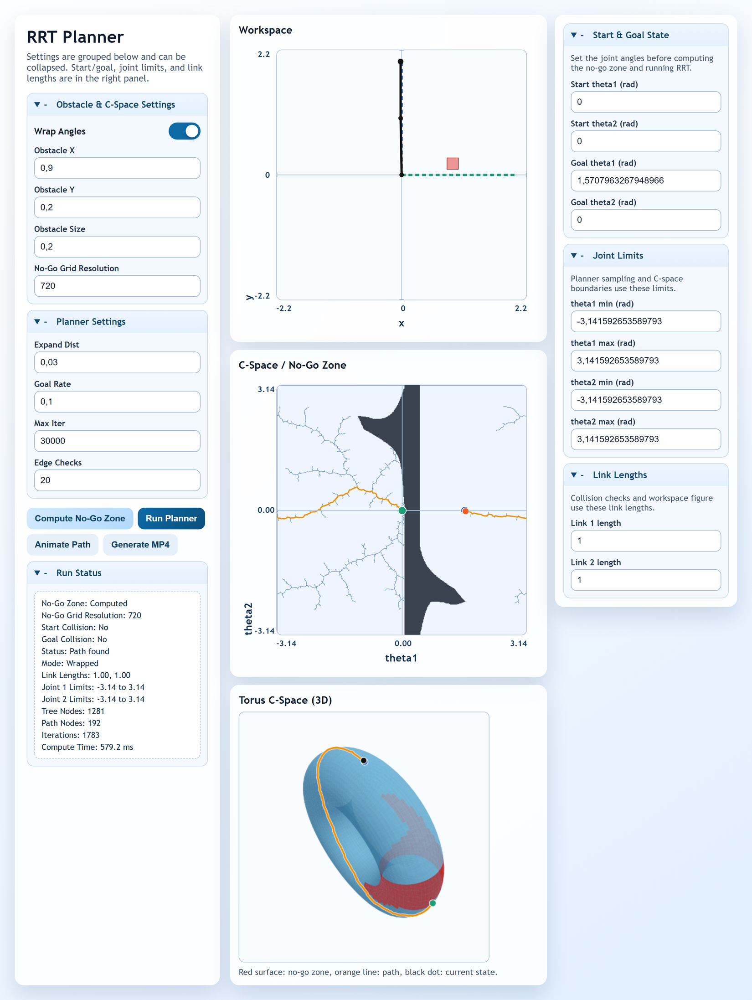
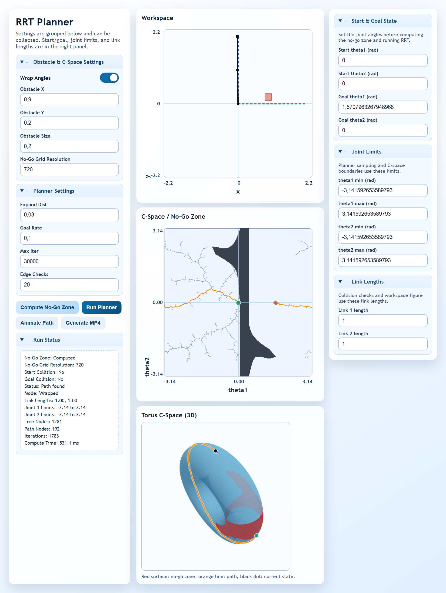
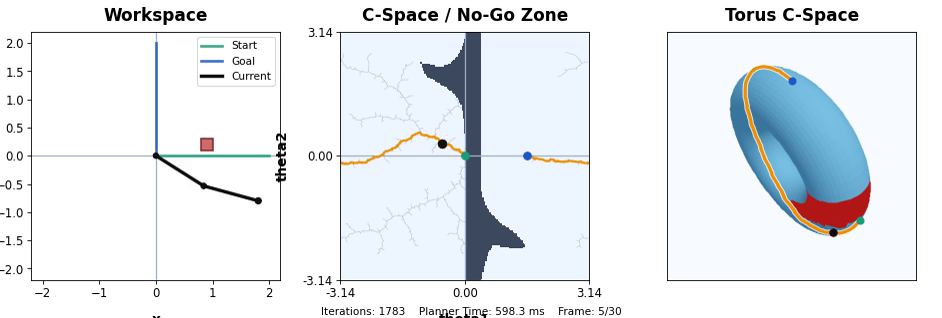
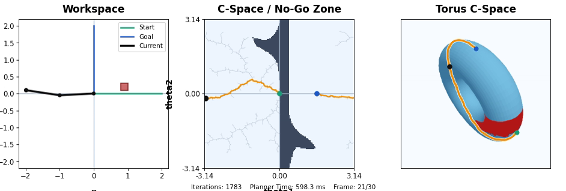

# RRT Planner

Last Updated: 2026-04-07 20:34 local time

Interactive 2D planar arm planner with obstacle avoidance, configuration-space analysis, torus visualization, path animation, and MP4 export.

## Screenshots

### UI Overview

<p align="center">
  
</p>

### UI After Compute No-Go Zone + Run Planner

<p align="center">
  
</p>

### Animation Frames

| Early | Later |
|---|---|
|  |  |

## What The Application Can Do

- Configure start and goal joint states.
- Configure joint limits for `theta1` and `theta2`.
- Configure link lengths (`l1`, `l2`) and use them in collision checking and workspace plotting.
- Configure obstacle position and size.
- Compute no-go zones in C-space before planning.
- Tune C-space grid resolution (higher resolution for finer no-go boundaries).
- Run RRT planning after no-go computation.
- Toggle wrapped planning when joint limits are periodic (full `2*pi` span).
- Automatically disable wrapping for bounded joint limits.
- Visualize:
  - Workspace (arm, obstacle, start/goal/current state)
  - C-space/no-go zone with tree, path, and current state
  - Torus view of C-space with no-go regions, path, and current state
- Animate path traversal in the UI.
- Export animation to MP4 from the UI.

## Architecture

- `frontend`: Vite + React UI.
- `backend`: FastAPI API for C-space computation, RRT planning, and MP4 export.

Main API routes:

- `GET /api/health`
- `POST /api/cspace`
- `POST /api/plan`
- `POST /api/export-mp4`

## Requirements

- Node.js 18+
- Python 3.12+ (3.13 also works)
- `ffmpeg` available on `PATH` (required for MP4 export)

Check ffmpeg:

```powershell
ffmpeg -version
```

## Run Locally

### 1) Start backend

```powershell
cd backend
py -m venv .venv
.\.venv\Scripts\Activate.ps1
pip install -r requirements.txt
uvicorn app.main:app --reload --host 0.0.0.0 --port 8000
```

Health check:

```powershell
curl http://localhost:8000/api/health
```

### 2) Start frontend

Open a second terminal:

```powershell
cd frontend
npm install
npm run dev
```

Open:

- http://localhost:5173

## UI Workflow

1. Set `Start & Goal State` in the right panel.
2. Set `Joint Limits` and `Link Lengths` in the right panel.
3. Set obstacle and C-space resolution in the left panel.
4. Click `Compute No-Go Zone`.
5. If start/goal are collision-free, click `Run Planner`.
6. Click `Animate Path` to play in the UI.
7. Click `Generate MP4` to download a video.

## MP4 Export

### From UI

- Click `Generate MP4`.
- The backend renders and returns a downloadable `.mp4`.

### From script (optional)

```powershell
$env:PYTHONPATH='backend'
uv run --with matplotlib python backend/scripts/export_animation_mp4.py `
  --output output/rrt_animation.mp4 `
  --cspace-resolution 240 `
  --samples-per-edge 2 `
  --fps 24 `
  --dpi 110
```

## API Example

### Plan request

```powershell
curl -X POST http://localhost:8000/api/plan `
  -H "Content-Type: application/json" `
  -d '{
    "start": [0.0, 0.0],
    "goal": [1.57079632679, 0.0],
    "obstacle": {"x": 0.9, "y": 0.2, "size": 0.2},
    "joint_limits": {
      "theta1_min": -3.14159265359,
      "theta1_max": 3.14159265359,
      "theta2_min": -3.14159265359,
      "theta2_max": 3.14159265359
    },
    "link_lengths": {"l1": 1.0, "l2": 1.0},
    "expand_dist": 0.03,
    "goal_rate": 0.1,
    "max_iter": 12000,
    "edge_check_steps": 20,
    "collision_buffer": 0.05,
    "wrap_angles": true,
    "include_cspace": false,
    "cspace_resolution": 180,
    "seed": 42
  }'
```

### Export MP4 request

```powershell
curl -X POST http://localhost:8000/api/export-mp4 `
  -H "Content-Type: application/json" `
  -d '{
    "start": [0.0, 0.0],
    "goal": [1.57079632679, 0.0],
    "obstacle": {"x": 0.9, "y": 0.2, "size": 0.2},
    "joint_limits": {
      "theta1_min": -3.14159265359,
      "theta1_max": 3.14159265359,
      "theta2_min": -3.14159265359,
      "theta2_max": 3.14159265359
    },
    "link_lengths": {"l1": 1.0, "l2": 1.0},
    "expand_dist": 0.03,
    "goal_rate": 0.1,
    "max_iter": 12000,
    "edge_check_steps": 20,
    "collision_buffer": 0.05,
    "wrap_angles": true,
    "include_cspace": true,
    "cspace_resolution": 180,
    "seed": 42,
    "fps": 10,
    "dpi": 76,
    "bitrate": 1200,
    "samples_per_edge": 1,
    "max_frames": 30
  }' --output rrt_animation.mp4
```

## Tests

```powershell
cd backend
py -m pytest -q
```

## Run With Docker Compose

```powershell
docker compose up --build
```

Default URLs:

- Frontend: http://localhost:5173
- Backend: http://localhost:8000

## Deployment Notes

### Frontend on Netlify or Vercel

Frontend deployment is supported on both Netlify and Vercel.

Required environment variable on frontend host:

- `VITE_API_BASE=https://<your-backend-domain>`

### Backend hosting

Deploy backend separately (for example Render, Railway, Fly.io, VPS, or container host) and configure CORS:

- `CORS_ALLOW_ORIGINS=https://<your-frontend-domain>`

Also ensure on backend host:

- `ffmpeg` is installed and on `PATH` if MP4 export is enabled.

## Troubleshooting

- `matplotlib is required for MP4 export`:
  - install backend dependencies again with `pip install -r backend/requirements.txt`.
- MP4 export fails with ffmpeg error:
  - check `ffmpeg -version` in backend environment.
- Wrap toggle disabled:
  - expected when joint limits are bounded and not full `2*pi` spans.
- Planner button disabled:
  - compute no-go zone first.
